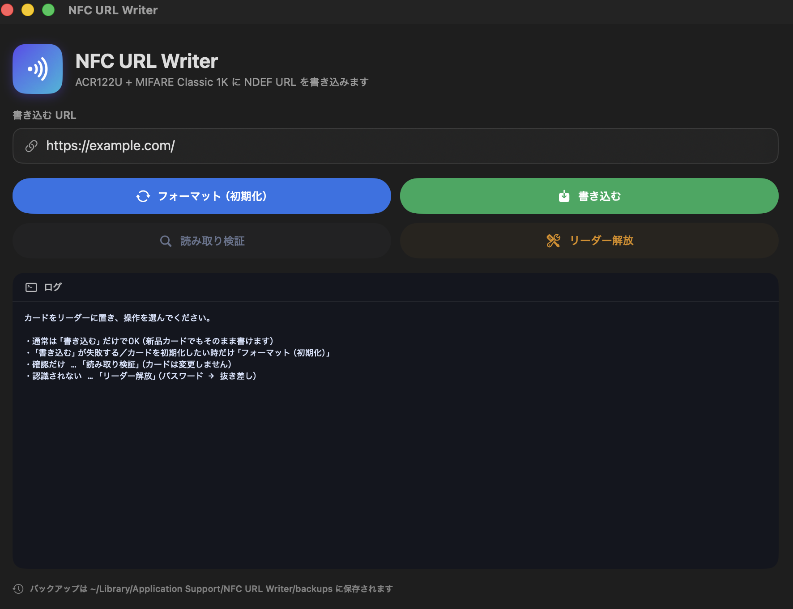

<div align="center">


# NFC URL Writer

**Write an NDEF URL to a MIFARE Classic 1K card on macOS — in one click.**

[](#license)
[](#requirements)
[](#building-from-source)
[](#how-it-works)
[](#requirements)

Getting an ACR122U talking to `libnfc` on a modern Mac is famously fiddly. This tool makes it boring: plug in the reader, type a URL, click **Write**.

</div>

<p align="center">
  
</p>

---

## What it does

NFC URL Writer programs a **URL into a MIFARE Classic 1K card** as a standard **NDEF URI record**, using an **ACR122U** USB reader on **macOS**. Tap the card with a phone afterward and it opens the URL.

It ships in three forms, all driving the **same core script** (`write-url.sh`):

1. A native, universal **SwiftUI `.app`** with one-click buttons and a built-in dependency installer.
2. A **CLI** (`write-url.sh`) for scripting and automation.
3. A **stdlib-only local web GUI** (`nfc-gui.py`) that runs in your browser.

## Why this exists

If you have ever tried to use an ACR122U with `libnfc` on macOS, you know the pain: the reader plugs in, but nothing can open it. The culprit is macOS's own smart-card stack — the `com.apple.ifdreader` CryptoTokenKit daemon — which **claims the USB device** before `libnfc` ever gets a chance.

The usual fix is a cryptic dance with `launchctl bootout` / `disable` followed by a physical re-plug. This tool **automates that fix** behind a single **Fix reader** button (or `--fix-reader`), so you can stop reading Stack Overflow threads and start writing cards.

## Supported tags & readers

| Tag | Status | Notes |
| --- | --- | --- |
| **MIFARE Classic 1K** | ✅ Fully supported | Primary target. Requires an **NXP-based reader** such as the **ACR122U**. |
| **NTAG213 / NTAG215 / NTAG216 (NFC Forum Type 2)** | 🟡 Supported (beta) | This is the **iPhone-readable** option (see [iPhone compatibility](#iphone-compatibility--please-read)). Writes via a read‑modify‑write that only touches NDEF data pages — lock/OTP/UID pages are never written. Verified on real NTAG215 hardware: write → in-line verify → independent read-back round-trips correctly, including custom URLs. Still newer than the MIFARE Classic path, so it's labeled beta rather than fully mature. |
| **MIFARE DESFire (NFC Forum Type 4)** | 🧪 Experimental | Basic create-ndef / write-ndef / read-ndef flow. |
| **FeliCa** | ❌ Not supported | Detected and rejected with a clear error — no NDEF write path exists for FeliCa here. |

The tool auto-detects the tag type from its SAK (or FeliCa signaling) on every run and routes to the right code path, refusing with a specific error rather than a confusing hardware failure.

### Reader compatibility

| Reader | Status | Notes |
| --- | --- | --- |
| **ACR122U** (and other NXP/libnfc-compatible readers) | ✅ Supported | The tool's primary target. |
| **Sony RC-S300 / PaSoRi (FeliCa Port)** | ❌ Not usable | `libnfc` cannot open this device at all (`nfc_open` fails on it), and even if it could, MIFARE Classic's Crypto1 authentication isn't something a FeliCa-only reader can do. This is a hardware/driver limitation, not something this tool can work around. |

**If both an ACR122U and a Sony PaSoRi are plugged in at the same time**, the tool now detects the working NXP reader and pins it via `LIBNFC_DEFAULT_DEVICE`, so it reliably selects the ACR122U and never gets stuck probing (or hanging on) the incompatible PaSoRi. This fixes a real flakiness issue on Macs that have both readers connected — see **Smart reader selection** below.

## Features

- **Three interfaces, one engine** — native app, CLI, and a local web GUI, all calling the same audited `write-url.sh`.
- **Smart reader selection** — automatically picks a working NXP reader (e.g. ACR122U) and skips incompatible ones like a Sony PaSoRi/FeliCa reader, fixing the flakiness on Macs that have both. It does this by pinning `LIBNFC_DEFAULT_DEVICE` to the working driver, so both `nfc-list`-style tools and libfreefare's `mifare-classic-*` tools consistently open the right device instead of racing (or getting stuck on the wrong one).
- **Fixed a regression where MIFARE Classic read/write could crash on some setups** because the reader-pinning above enumerated the reader twice for libfreefare's NDEF tools; those tools now run with the pin unset.
- **ACR122U beep restored** via a small bundled libusb helper (`acr122-beep`) that fires the reader's own buzzer on success — falls back to a Mac sound if the helper isn't available for your architecture.
- **Live reader/tag status + supported-compat panel in the app** — a status panel shows which reader and tag type are currently detected (with color-coded confidence), plus an expandable panel listing supported readers and tag types, so you know what to expect before you write.
- **One-click setup** — the app detects whether `libnfc` / `libfreefare` are present and **installs them via Homebrew on first run** (with live progress), so non-technical users can get going without touching a terminal.
- **One-click reader fix** — automates the `com.apple.ifdreader` `launchctl` workaround that trips up nearly everyone on macOS.
- **Safe by design** — never edits sector trailers, keys, or access bits directly. It hands the NDEF message to `libfreefare`, which manages the MAD, TLV, and NFC-Forum keys correctly.
- **Backup before write** — dumps the card to a timestamped `.mfd` file before making any changes.
- **Verify after write** — reads the card back and compares it against what was written, so a "success" actually means success.
- **Automatic retries** — reader detection, backup, format, and write/read operations retry automatically (up to 4 attempts) before failing, which smooths over machines where macOS's smart-card daemon races `libnfc` for the reader.
- **Self-healing MIFARE Classic write** — if a normal write fails (e.g. a previously-used card with non-default keys), the tool automatically re-initializes the card and writes again, instead of surfacing a raw crash/error.
- **Sound feedback** — plays a success or failure sound (via the Mac's own speaker, and the ACR122U's own beep when available) when a write or read finishes, so you don't have to stare at the terminal. Disable with `--no-sound` or `NFC_SOUND=0`.
- **Friendlier empty-card message** — reading a blank/unformatted card reports a plain "this card is still empty" message instead of a scary-looking error.
- **Universal binary** — builds for both Apple Silicon (`arm64`) and Intel (`x86_64`).

## Screenshots


## Requirements

- **macOS** (Apple Silicon or Intel).
- **[Homebrew](https://brew.sh)** — the app can install it for you if it is missing.
- **`libnfc` + `libfreefare`** — installed via Homebrew (the app installs them on first run).
- **Hardware:** an **ACR122U** USB NFC reader and one or more **MIFARE Classic 1K** cards.

> `libnfc` and `libfreefare` are **not bundled** — they are installed through Homebrew. See [License](#license).

## Install & Quickstart

### Easiest: the app

1. Open the **[latest release](https://github.com/lead-yamamoto/nfc-url-writer/releases/latest)** and download **`NFC-URL-Writer.dmg`** from the **Assets** section — **not** the "Source code" archive (that's source only, no app).
2. Open the `.dmg`, then **drag `NFC URL Writer.app` onto the `Applications` folder**. If a previous version is already installed, choose **Replace** — this overwrites the old copy in place and is what prevents the duplicate **"NFC URL Writer 2 / 3"** copies you get from repeatedly downloading the zip. Installing to **Applications** also avoids macOS **App Translocation** (running from a random Downloads folder). Then launch it from **Applications**.
   - _Alternative:_ download **`NFC-URL-Writer-macOS.zip`** instead, unzip it to get `NFC URL Writer.app`, and move it into **Applications** yourself. (Or [build from source](#building-from-source).)
3. **First launch:** the app is unsigned, so macOS blocks it once. **Right-click the app → Open** and confirm; or open **System Settings → Privacy & Security**, scroll down, and click **Open Anyway** (macOS 15+); or run `xattr -dr com.apple.quarantine "/Applications/NFC URL Writer.app"` in Terminal.
4. If the NFC tools are missing, click **Install required tools** — the app runs `brew install libnfc libfreefare` for you.
5. Plug in the ACR122U, place a card on it, type your URL, and click **Write**.

### Or install the dependencies yourself

```bash
brew install libnfc libfreefare
```

Then use the CLI or web GUI below.

## Usage

### Native app

| Button | What it does |
| --- | --- |
| **Write** | Writes the URL to the card. New, unformatted cards usually work directly. |
| **Format (initialize)** | NDEF-formats the card first — use this if **Write** fails or you want a clean card. |
| **Read & verify** | Reads the card and shows the URL on it. Does **not** modify the card. |
| **Fix reader** | Releases the reader from macOS's smart-card daemon (asks for your password, then re-plug the ACR122U). |

Backups are saved to `~/Library/Application Support/NFC URL Writer/backups`.

### CLI — `write-url.sh`

The URL is supplied via the `TARGET_URL` environment variable (or by editing the default at the top of the script):

```bash
# First write to a brand-new card: format, then write
TARGET_URL="https://example.com/" ./write-url.sh --format

# Subsequent writes: just write the URL
TARGET_URL="https://example.com/" ./write-url.sh

# Read back the URL currently on the card (read-only)
./write-url.sh --read

# Release the reader from macOS's smart-card daemon
./write-url.sh --fix-reader

# Check which reader and tag are currently detected, without writing anything
./write-url.sh --detect
```

Useful flags:

| Flag | Effect |
| --- | --- |
| `--format` | NDEF-format the card before writing (required for a fresh card). |
| `--read` | Read and decode the NDEF URL on the card. |
| `--detect` | Report the detected reader and tag type, then exit — no write, no format. |
| `--fix-reader` | Disable `com.apple.ifdreader` so `libnfc` can open the ACR122U. |
| `--print-ndef` | Print the generated NDEF bytes and exit (no hardware needed). |
| `--no-backup` | Skip the pre-write backup. |
| `--no-sound` | Skip the success/failure sound (same as `NFC_SOUND=0`). |
| `--self-test` | Run internal unit tests (e.g. SAK/tag-type routing) — no hardware needed. |
| `--yes` / `-y` | Skip confirmation prompts. |
| `--help` | Full help. |

`NFC_BACKUP_DIR` overrides where backups are written. `LIBNFC_DEFAULT_DEVICE` is set automatically by the reader-selection logic above; you normally don't need to set it yourself.

### Local web GUI — `nfc-gui.py`

A zero-dependency, standard-library web UI that binds to `127.0.0.1` only:

```bash
python3 nfc-gui.py
```

(Or just double-click **`nfc-gui.command`** in Finder.) It opens in your browser and shells out to the same `write-url.sh`.

## How it works

A URL is encoded as a single **NDEF URI record** (NFC Forum "well-known" type `U`, `0x55`), using the standard URI-prefix abbreviations (`https://www.`, `https://`, `tel:`, `mailto:`, …) to save bytes.

That raw NDEF message is handed to `libfreefare`'s `mifare-classic-write-ndef`, which takes care of the **MIFARE-specific plumbing** — the MAD (MIFARE Application Directory), the TLV wrapping, and the NFC-Forum sector keys / access bits. The tool itself never pokes at sector trailers, which keeps your card recoverable.

The pipeline for a write is:

```
nfc-list (detect reader)  →  backup (.mfd)  →  [--format]  →
write-ndef (URL)          →  read-ndef (verify against what was written)
```

## iPhone compatibility — please read

> [!IMPORTANT]
> **iPhones generally cannot read NDEF from MIFARE Classic cards.**
>
> MIFARE Classic is **not** one of the NFC Forum tag types (Type 1–5). iOS Core NFC reads NDEF from NFC-Forum tags, so even though the write succeeds, **an iPhone usually will not react to a MIFARE Classic card** written by this tool.
>
> - **For iPhone**, use **NTAG213 / NTAG215 / NTAG216** (NFC Forum Type 2) tags instead — this tool has **beta** support for writing to them, verified on real NTAG215 hardware (see [Supported tags & readers](#supported-tags--readers)).
> - **Most Android phones can read MIFARE Classic** NDEF just fine.

If your audience is iPhone users, choose NTAG hardware. If you control the readers or target Android, MIFARE Classic 1K works great.

## Distributing the app

The app is **ad-hoc signed** (not notarized), so Gatekeeper will warn on first launch on another Mac. Recipients should either:

- **Right-click → Open** the app once, then confirm in the dialog, **or**
- clear the quarantine attribute:

  ```bash
  xattr -dr com.apple.quarantine "NFC URL Writer.app"
  ```

The scripts are bundled inside the `.app`, so you can distribute the app on its own. Recipients still need an ACR122U and the Homebrew dependencies (which the app can install for them).

## Troubleshooting

### Reader not detected / `nfc-list` can't open the device

This is the **most common issue on macOS**: the system smart-card daemon `com.apple.ifdreader` has claimed the ACR122U. Release it:

- **App:** click **Fix reader** (enter your password when asked).
- **CLI:** `./write-url.sh --fix-reader`

Either way, **unplug and re-plug the ACR122U** afterward, then try again.

Under the hood this runs:

```bash
sudo launchctl bootout system/com.apple.ifdreader
sudo launchctl disable system/com.apple.ifdreader
sudo launchctl bootout system/com.apple.usbsmartcardreaderd
sudo launchctl disable system/com.apple.usbsmartcardreaderd
```

To undo it later:

```bash
sudo launchctl enable system/com.apple.ifdreader
sudo launchctl enable system/com.apple.usbsmartcardreaderd
# then re-plug the reader or reboot
```

### Other checks

- Use a **direct USB port** or a **powered hub** — flaky cables and unpowered hubs cause intermittent failures.
- Some **ACR122U clones** open in `nfc-list` but fail on write.
- A brand-new card may need `--format` (or the **Format** button) before its first write.

## Safety

- **Never writes sector trailers, keys, or access bits directly.** All MIFARE-specific structure is delegated to `libfreefare`.
- **Backs up the card** to a timestamped `.mfd` before writing (skip with `--no-backup`).
- **Verifies after writing** by reading the card back and comparing.

## Building from source

You need Xcode or the Command Line Tools (for `swiftc`):

```bash
xcode-select --install   # if you don't already have swiftc
./build-app.sh           # produces "NFC URL Writer.app"
```

`build-app.sh` compiles a **universal binary** (`arm64` + `x86_64` when available), bundles `write-url.sh` into the app's `Resources`, generates the icon, and ad-hoc signs the result. The URL is always passed in at runtime via the `TARGET_URL` environment variable — the bundled script is never rewritten.

## License

This project's code is released under the **MIT License** — see [`LICENSE`](LICENSE).

It depends on, but does **not bundle**, the following LGPL libraries, which you install separately via Homebrew:

- **[libnfc](https://github.com/nfc-tools/libnfc)** — low-level NFC device access (LGPL).
- **[libfreefare](https://github.com/nfc-tools/libfreefare)** — MIFARE Classic NDEF / MAD handling (LGPL).

Because they are installed through Homebrew rather than redistributed here, there is no LGPL redistribution burden on this repository. Huge thanks to the `nfc-tools` community for making any of this possible.

---

<div align="center">
<sub>Built for the corner of the world where ACR122U meets macOS and refuses to cooperate. Now it does.</sub>
</div>
